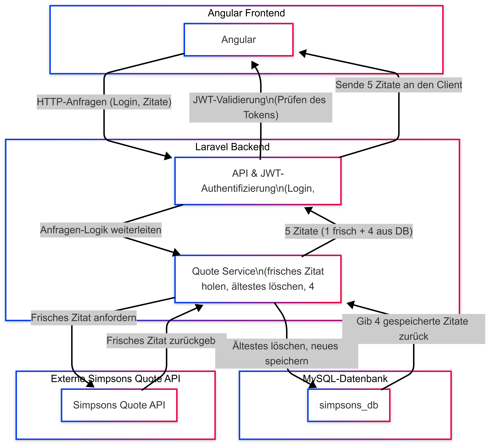

# Simpsons Code Challenge

This project is a full-stack web application built for the Hanseatic Bank Code Challenge. It uses:

- **Angular** for the frontend,
- **Laravel** (PHP) for the backend,
- **MySQL** for the database,
- **JWT** for authentication,
- and integrates with an external Simpsons Quote API.

## Overview of the Architecture

See the [ARCHITECTURE.md](ARCHITECTURE.md) file for a detailed diagram explanation.

## Architecture Overview



The diagram above shows how the Angular frontend, Laravel backend, MySQL database, and the external Simpsons Quote API interact to form the complete system.

### System Components

- **Angular Frontend (Client):**

  - Sends HTTP requests (e.g., for login and fetching quotes) to the backend.
  - Upon successful login, receives a JWT token, which is stored in the browser (e.g., in localStorage).
  - If the authentication token is missing or invalid, the user is redirected back to the login page.
  - Displays a page with 5 quotes: 1 freshly fetched quote from the external API and 4 stored quotes from the database.

- **Laravel Backend:**

  - Processes API requests and handles authentication using JWT.
  - Acts as a security gateway: it calls the external Simpsons Quote API to fetch a fresh quote, filters sensitive data, and manages the quotes in the database.
  - Maintains exactly 4 stored quotes by deleting the oldest entry and inserting the new quote.
  - Returns a combined array of 5 quotes (1 fresh + 4 stored) to the frontend.

- **MySQL Database:**

  - Stores the last 4 quotes.
  - The backend interacts with the database (either via Docker Compose in a containerized setup or a local installation).

- **External Simpsons Quote API:**

  - Provides a fresh quote each time it is called.
  - The backend accesses this API, filters the data, and stores/processes it before sending it to the frontend.

- **Deployment Options:**
  - **Without Docker (Local Setup):** The backend is run locally using `php artisan serve` and connects to a locally installed MySQL instance.
  - **With Docker:** The backend and MySQL database will run in separate Docker containers orchestrated by Docker Compose.

## Installation and Setup Instructions

### Option 1: Local Setup (Without Docker)

#### Backend (Laravel)

1. **Clone the repository:**

   ```bash
   git clone <repository-url>
   cd <repository-folder>/simpsons-backend

   ```

2. **Install PHP dependencies:**
   composer install

3. **Configure Environment Variables: Edit the .env file in simpsons-backend to match your local MySQL setup. For example:**

- DB_CONNECTION=mysql
- DB_HOST=127.0.0.1
- DB_PORT=3306
- DB_DATABASE=simpsons_db
- DB_USERNAME=<your_db_username>
- DB_PASSWORD=<your_db_password>

4. **Run Database Migrations:**
   php artisan migrate

#### Frontend (Angular)

1. **Navigate to the Angular project folder:**
   cd <repository-folder>/simpsons-frontend

2. **Install npm dependencies:**
   npm install

3. **Build the Angular site**
   npm run buildCopy

### Start the application

php artisan serve

The Application will be available at http://localhost:8000.

- User: testuser
- password: secret123

### Option 2: Containerized Setup (With Docker)

1. **Navigate to the laravel backend**
   cd <repository-folder>/simpsons-backend

2. **Start the Docker container**

   - docker compose up --build
   - docker exec -it simpsons-backend php artisan migrate
   - check the .env file if this is set:

     - DB_CONNECTION=mysql
     - #DB_HOST=db
     - DB_HOST=host.docker.internal
     - DB_PORT=3306
     - DB_DATABASE=simpsons_db
     - DB_USERNAME=simpsons
     - DB_PASSWORD=simpsons

   - Note: The Laravel backend container is accessible at http://localhost:8000,
     while the MySQL container is accessed via the Docker network. Currently, DB_HOST=db is not working due to unresolved network issues, so please use host.docker.internal as a temporary workaround.
